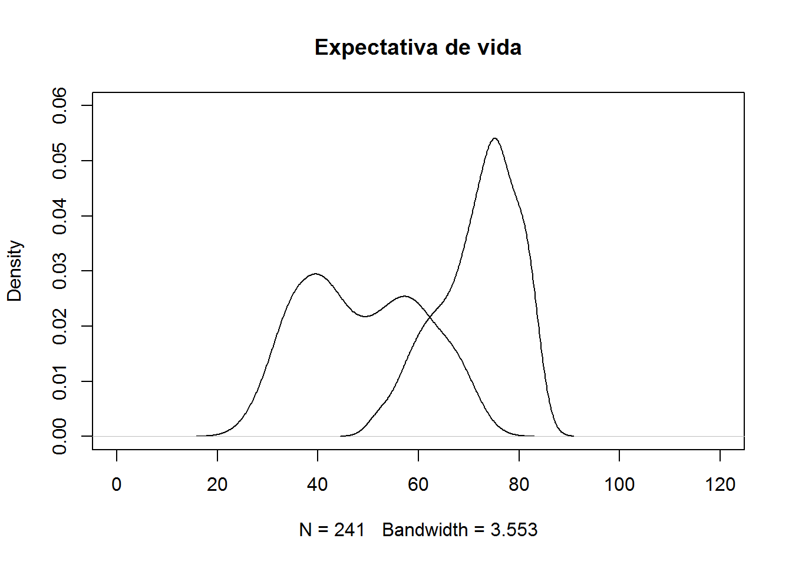

Los datos
---------

La base datos que se analiza aquí fue tomada de <https://github.com/rfordatascience/tidytuesday/tree/master/data>.

``` r
require(readr)
dt <- read_csv("life.txt")
dim(dt)
## [1] 17894     4
head(dt)
## # A tibble: 6 x 4
##   country     code   year life_expectancy
##   <chr>       <chr> <int>           <dbl>
## 1 Afghanistan AFG    1950            27.5
## 2 Afghanistan AFG    1951            27.8
## 3 Afghanistan AFG    1952            28.4
## 4 Afghanistan AFG    1953            28.9
## 5 Afghanistan AFG    1954            29.4
## 6 Afghanistan AFG    1955            29.9
```

Expectativa de vida en 1950 y 2015
----------------------------------

``` r
dt1950 <- subset(dt, year == 1950)
dt2015 <- subset(dt, year == 2015)

plot(density(dt1950$life_expectancy), xlim=c(0, 120), ylim=c(0, 0.06),
     main='Expectativa de vida')
lines(density(dt2015$life_expectancy))
```


