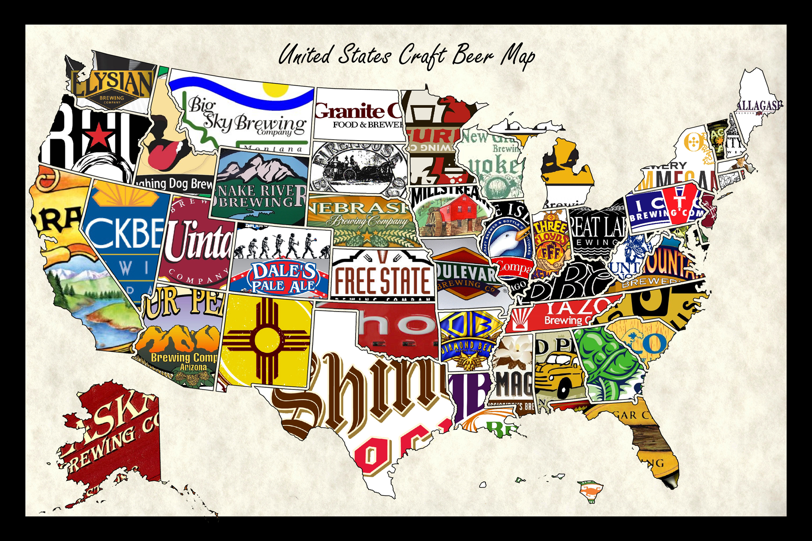

```{r}
require(tidyverse)
```




## Los datos
La base datos que se analiza aquí fue tomada de https://github.com/rfordatascience/tidytuesday/tree/master/data.

```{r, message=FALSE, eval=FALSE}
require(readxl)
dt <- read_excel("week15_beers.xlsx")
dim(dt)
head(dt)
```

The variables of the dataset are:

- abv: The alcoholic content by volume with 0 being no alcohol and 1 being pure alcohol.
- ibu: International bittering units, which describe how bitter a drink is.
- id: Unique ID.
- name: Name of the beer.
- style: Beer style (lager, ale, IPA, etc.)
- brewery_id: Unique identifier for brewery that produces this beer; can use to join with brewery info.
- ounces: Size of beer in ounces.

# Exploring the alcoholic content and the bittering

```{r}
dtcomplete <- dt %>% na.omit
ggplot(dtcomplete, aes(abv, ibu)) + geom_point()
```


```{r}
library(maps)
library(ggplot2)
thismap <- map_data("state")
ggplot(thismap, aes(long, lat, group=group, fill=region)) + 
  geom_polygon(show.legend = F) +
  ggtitle("Map of USA") + coord_quickmap()
```


