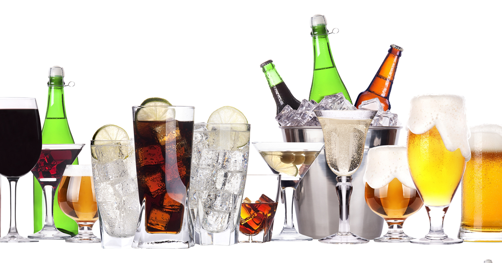

```{r setup, include=FALSE}
knitr::opts_chunk$set(echo = TRUE)
```



## Los datos
La base datos que se analiza aquí fue tomada de https://github.com/rfordatascience/tidytuesday/tree/master/data.

```{r, message=FALSE}
require(readr)
dt <- read_csv("week13_alcohol_global.txt")
dim(dt)
dt
```

```{r}
colnames(dt) <- c('country', 'beer', 'spirit', 'wine', 'total')
dt
```


# Who drinks the most beer, spirits and wine?
```{r, message=FALSE}
require(dplyr)
dt %>% arrange(desc(beer))
dt %>% arrange(desc(spirit))
dt %>%  arrange(desc(wine))
```

```{r}
library(maps)
library(ggplot2)
thismap <- map_data("world")
thismap$country <- thismap$region
datos <- full_join(thismap, dt, by='country')
```

```{r}
map1 <- ggplot(datos, aes(long, lat, group=group, fill=beer)) +
               geom_polygon() + 
               ggtitle("Consumption of beer (liters)")

map1 + scale_fill_gradient(low='white', high='darkblue') +
coord_quickmap()
```

```{r}
map2 <- ggplot(datos, aes(long, lat, group=group, fill=spirit)) +
               geom_polygon() + 
               ggtitle("Consumption of spirit (liters)")

map2 + scale_fill_gradient(low='white', high='darkgreen') +
coord_quickmap()
```

```{r}
map3 <- ggplot(datos, aes(long, lat, group=group, fill=wine)) +
               geom_polygon() + 
               ggtitle("Consumption of wine (liters)")

map3 + scale_fill_gradient(low='white', high='darkorange') +
coord_quickmap()
```


