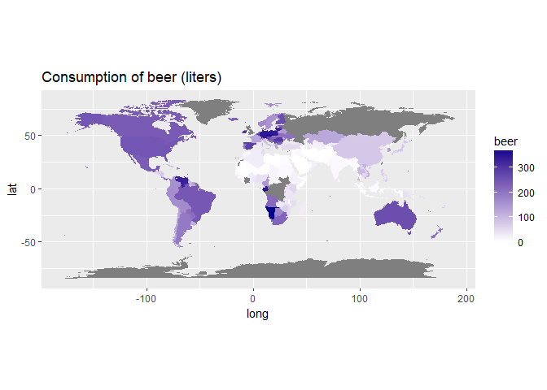
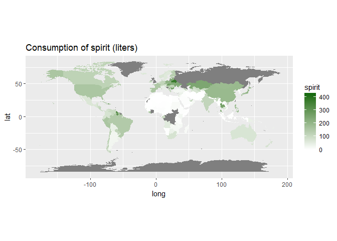
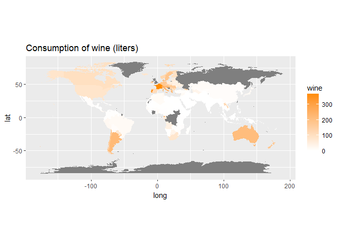

## Los datos
La base datos que se analiza aquí fue tomada de https://github.com/rfordatascience/tidytuesday/tree/master/data.


```r
require(readr)
dt <- read_csv("week13_alcohol_global.txt")
dim(dt)
```

```
## [1] 193   5
```

```r
dt
```

```
## # A tibble: 193 x 5
##    country   beer_servings spirit_servings wine_servings total_litres_of_~
##    <chr>             <int>           <int>         <int>             <dbl>
##  1 Afghanis~             0               0             0             0    
##  2 Albania              89             132            54             4.90 
##  3 Algeria              25               0            14             0.700
##  4 Andorra             245             138           312            12.4  
##  5 Angola              217              57            45             5.90 
##  6 Antigua ~           102             128            45             4.90 
##  7 Argentina           193              25           221             8.30 
##  8 Armenia              21             179            11             3.80 
##  9 Australia           261              72           212            10.4  
## 10 Austria             279              75           191             9.70 
## # ... with 183 more rows
```


```r
colnames(dt) <- c('country', 'beer', 'spirit', 'wine', 'total')
dt
```

```
## # A tibble: 193 x 5
##    country            beer spirit  wine  total
##    <chr>             <int>  <int> <int>  <dbl>
##  1 Afghanistan           0      0     0  0    
##  2 Albania              89    132    54  4.90 
##  3 Algeria              25      0    14  0.700
##  4 Andorra             245    138   312 12.4  
##  5 Angola              217     57    45  5.90 
##  6 Antigua & Barbuda   102    128    45  4.90 
##  7 Argentina           193     25   221  8.30 
##  8 Armenia              21    179    11  3.80 
##  9 Australia           261     72   212 10.4  
## 10 Austria             279     75   191  9.70 
## # ... with 183 more rows
```


# Who drinks the most beer, spirits and wine?

```r
require(dplyr)
dt %>% arrange(desc(beer))
```

```
## # A tibble: 193 x 5
##    country         beer spirit  wine total
##    <chr>          <int>  <int> <int> <dbl>
##  1 Namibia          376      3     1  6.80
##  2 Czech Republic   361    170   134 11.8 
##  3 Gabon            347     98    59  8.90
##  4 Germany          346    117   175 11.3 
##  5 Lithuania        343    244    56 12.9 
##  6 Poland           343    215    56 10.9 
##  7 Venezuela        333    100     3  7.70
##  8 Ireland          313    118   165 11.4 
##  9 Palau            306     63    23  6.90
## 10 Romania          297    122   167 10.4 
## # ... with 183 more rows
```

```r
dt %>% arrange(desc(spirit))
```

```
## # A tibble: 193 x 5
##    country             beer spirit  wine total
##    <chr>              <int>  <int> <int> <dbl>
##  1 Grenada              199    438    28 11.9 
##  2 Belarus              142    373    42 14.4 
##  3 Haiti                  1    326     1  5.90
##  4 Russian Federation   247    326    73 11.5 
##  5 St. Lucia            171    315    71 10.1 
##  6 Guyana                93    302     1  7.10
##  7 Slovakia             196    293   116 11.4 
##  8 Dominica              52    286    26  6.60
##  9 Thailand              99    258     1  6.40
## 10 Cook Islands           0    254    74  5.90
## # ... with 183 more rows
```

```r
dt %>%  arrange(desc(wine))
```

```
## # A tibble: 193 x 5
##    country            beer spirit  wine total
##    <chr>             <int>  <int> <int> <dbl>
##  1 France              127    151   370 11.8 
##  2 Portugal            194     67   339 11.0 
##  3 Andorra             245    138   312 12.4 
##  4 Switzerland         185    100   280 10.2 
##  5 Denmark             224     81   278 10.4 
##  6 Slovenia            270     51   276 10.6 
##  7 Luxembourg          236    133   271 11.4 
##  8 Croatia             230     87   254 10.2 
##  9 Italy                85     42   237  6.50
## 10 Equatorial Guinea    92      0   233  5.80
## # ... with 183 more rows
```


```r
library(maps)
library(ggplot2)
thismap <- map_data("world")
thismap$country <- thismap$region
datos <- full_join(thismap, dt, by='country')
```


```r
map1 <- ggplot(datos, aes(long, lat, group=group, fill=beer)) +
               geom_polygon() + 
               ggtitle("Consumption of beer (liters)")

map1 + scale_fill_gradient(low='white', high='darkblue') +
coord_quickmap()
```

<!-- -->


```r
map2 <- ggplot(datos, aes(long, lat, group=group, fill=spirit)) +
               geom_polygon() + 
               ggtitle("Consumption of spirit (liters)")

map2 + scale_fill_gradient(low='white', high='darkgreen') +
coord_quickmap()
```

<!-- -->


```r
map3 <- ggplot(datos, aes(long, lat, group=group, fill=wine)) +
               geom_polygon() + 
               ggtitle("Consumption of wine (liters)")

map3 + scale_fill_gradient(low='white', high='darkorange') +
coord_quickmap()
```

<!-- -->


